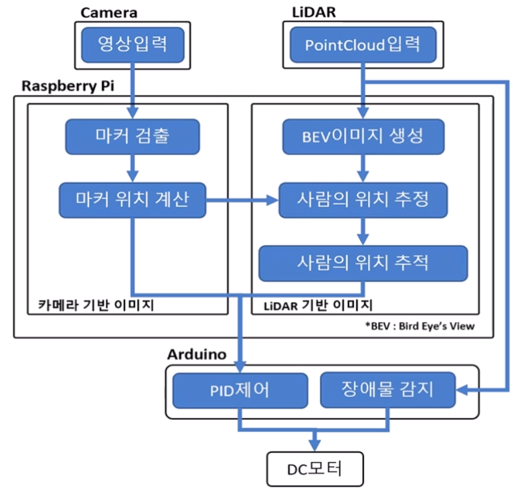

# LiDAR and Camera based Human Following Robot

    

[Youtube - Demo](https://youtu.be/2MJLY7LPSYQ)

[Youtube - Presentation](https://youtu.be/6JzITvlSfUM)

## Introduction
2020년 1학기 아주대학교 기계공학과 캡스톤디자인 PMDL팀의 결과물 소스코드입니다. 

2D라이다와 카메라를 바탕으로 환자를 따라 주행하는 링거대를 제작했습니다.

환자복에 아루코 마커와 같이 환자를 특정할 수 있는 마커가 인쇄되어있음을 가정했습니다.

실내, 실외, 경사로, 화장실, 엘레베이터 등의 환경에서 주행이 가능함을 확인하였습니다. 

작업 기간 : 2020.03 - 2020.06

팀 구성 : 전영재, 송민용, 김형석, 김윤범, 조성민

[제5회 정밀공학 창의경진대회 우수상](https://www.kspe.or.kr/board/index.html?menu_main=7&menu_sub=55&uid=1571&pos=22&ifwhat=total&ifvalue=%B0%E6%C1%F8%B4%EB%C8%B8&gubun=1&actmode=view)

## System

    

- Raspberry Pi 4B - 4GB : raspberrypi_main.py
  - [640x480p Camera](https://www.devicemart.co.kr/goods/view?no=1378738)
  - [YDLiDAR X2](https://www.devicemart.co.kr/goods/view?no=12170774)
- Arduino UNO : arduino_main.ino
  - Ultrasonic
  - DC Motor

## Demo 
### Camera and LiDAR based human following

    
    

### Human following with obstacles

    
    

    
    
    

### Human following in outdoor

    
    

